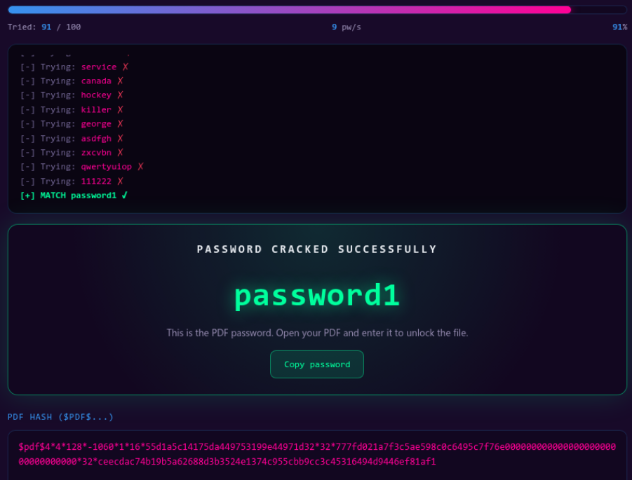
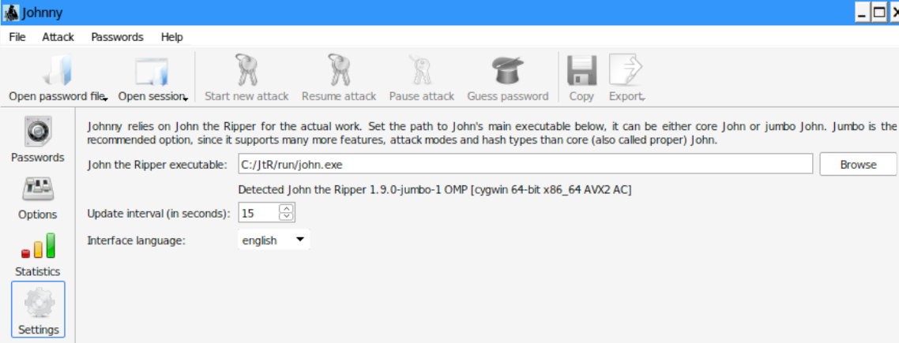
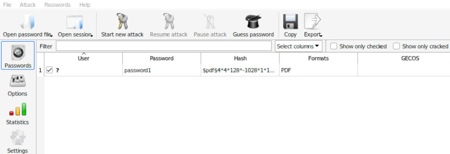
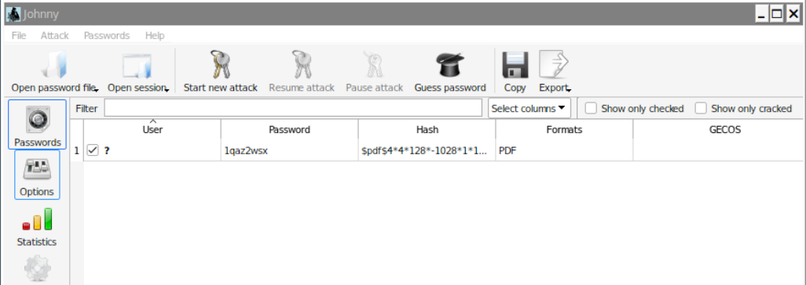
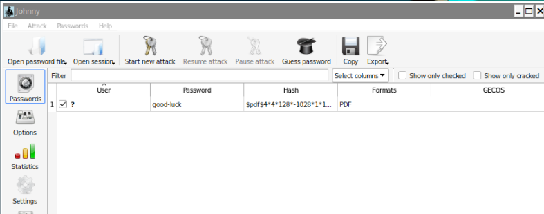

# PDF Password Recovery & Hash Cracking Lab (Week 3)

A comprehensive technical walkthrough documenting PDF document hash extraction, offline credential recovery, and dictionary attacks using **John the Ripper (JTR)**, **Johnny GUI**, and browser-based cryptanalysis tools.

---

## 📌 Executive Summary

Password cracking is an essential technique used in security auditing to evaluate passphrase strength and demonstrate the risks of low-entropy secrets. When a PDF document is protected, its access key is stored as a cryptographic hash digest. 

This project documents the end-to-end workflow used to:
1. Extract `$pdf$` formatted hash digests from encrypted PDF targets (`My Locked PDF1.pdf`).
2. Execute online dictionary attacks via browser-based cracking suites.
3. Configure local offline cracking environments using **John the Ripper Jumbo** and **Johnny GUI**.
4. Analyze key recovery outputs and capture lab flags.

---

## ⚙️ Phase 1: Browser-Based Hash Extraction & Dictionary Attack (PM2)

### Step 1: Extracting Hash & Executing Web-Based Cracking
Extracted the $128\text{-bit}$ `$pdf$` hash digest (`$pdf$4*4*128*-1060...`) and ran a browser-based wordlist attack. The engine iterated through candidates at $9\text{ pw/s}$ before identifying `password1`.

---

### Step 2: Unlocking Document & Capturing Flag 1
Successfully unlocked the target document using the recovered key `password1` to unveil the primary lab flag.

**Flag Captured:** `nw{cybersecurity_flag_captured_2608}`

---

### Step 3: Capturing Flag 2
Unlocked the secondary document payload to verify successful completion of Project Module 2.

**Flag Captured:** `nw{networkwalks_flag_260821_1}`

---

## ⚙️ Phase 2: Offline Cracking via John the Ripper & Johnny GUI (PM1)

### Step 1: Configuring Environment & Linking Binaries
Linked the **Johnny GUI** front-end to the core `john.exe` binary (`v1.9.0-jumbo-1 OMP [cygwin 64-bit x86_64 AVX2 AC]`) located at `C:/JtR/run/john.exe`.

---

### Step 2: Recovering Target Credentials (`password1`)
Imported `hash1.txt` into Johnny to execute local wordlist attacks against the extracted PDF digest. Successfully recovered `password1`.

---

### Step 3: Recovering Target Credentials (`1qaz2wsx`)
Processed the target hash to recover the sequential keyboard walk passphrase `1qaz2wsx`.

---

### Step 4: Recovering Target Credentials (`good-luck`)
Recovered the target passphrase `good-luck` from the loaded PDF hash list.

---

### Step 5: Document Authentication & Capturing Flag 3
Authenticated against the secured PDF using the JTR-recovered credentials to capture the persistence flag.

**Flag Captured:** `nw{networkwalks_persistence_jtr_270521}`

---

## 🔒 Security Takeaways & Mitigation Strategies

1. **Vulnerability of Low-Entropy Passphrases:**
   * Standard passphrases like `password1` or keyboard patterns like `1qaz2wsx` exist within default dictionary wordlists. Offline cracking engines test millions of candidates per second, rendering short passwords ineffective regardless of underlying encryption key length ($128\text{-bit}$).

2. **One-Way Hashes vs. Reversible Encryption:**
   * Documents enforce access control by storing a hashed representation of the access secret. Extracting local hash files allows attackers to perform unlimited attempts offline without triggering account lockout controls.

3. **Recommended Countermeasures:**
   * Enforce passphrase policies requiring minimum lengths ($15+$ characters) combining randomized alphanumeric and special characters.
   * Upgrade legacy PDF encryption handlers (e.g., Revision 4/V4 $128\text{-bit}$) to modern AES-256 standards with higher key derivation iteration counts (PBKDF2).

---

## 📜 References & Acknowledgments
* **Lab Materials:** Networkwalks Training Academy — Cybersecurity & Ethical Hacking Project Tasks (Week 3).
* **Core Software:** [Openwall John the Ripper](https://www.openwall.com/john/) & [Johnny GUI Project](https://openwall.info/wiki/john/johnny).
